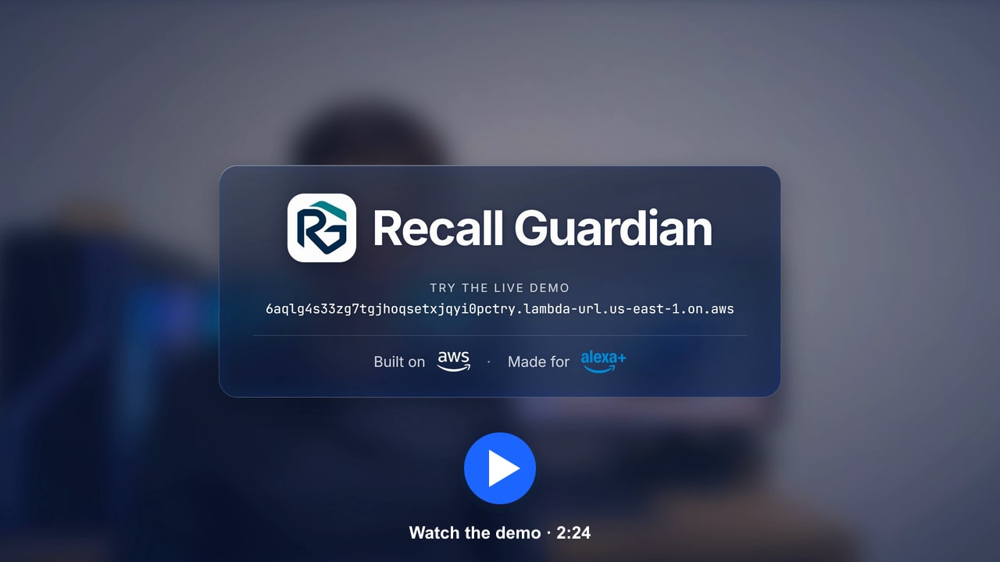
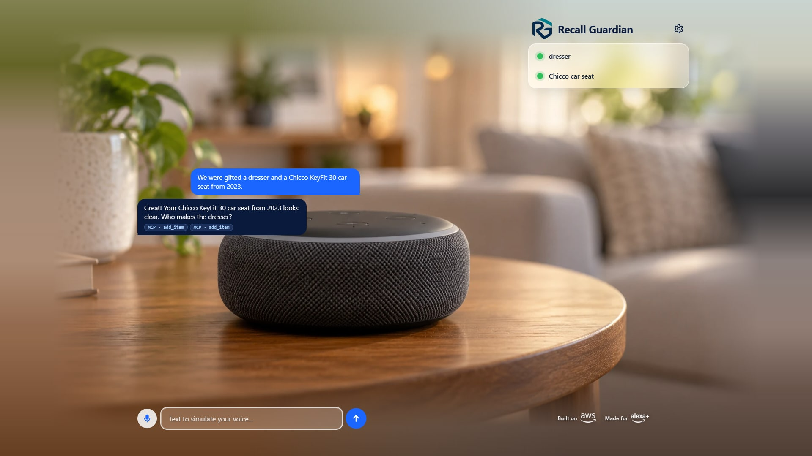
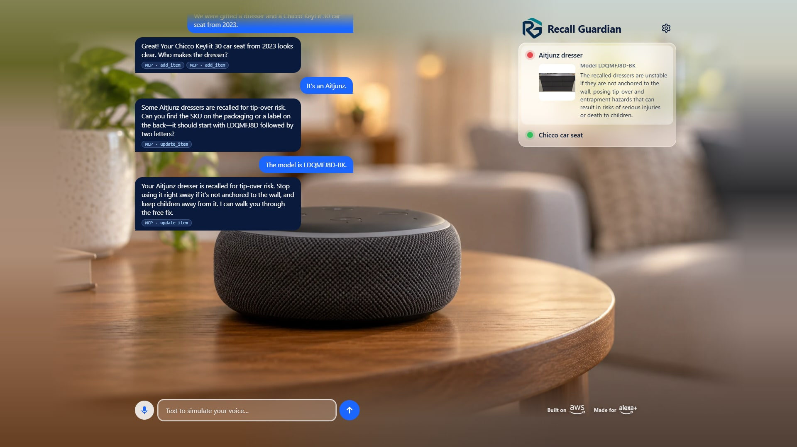
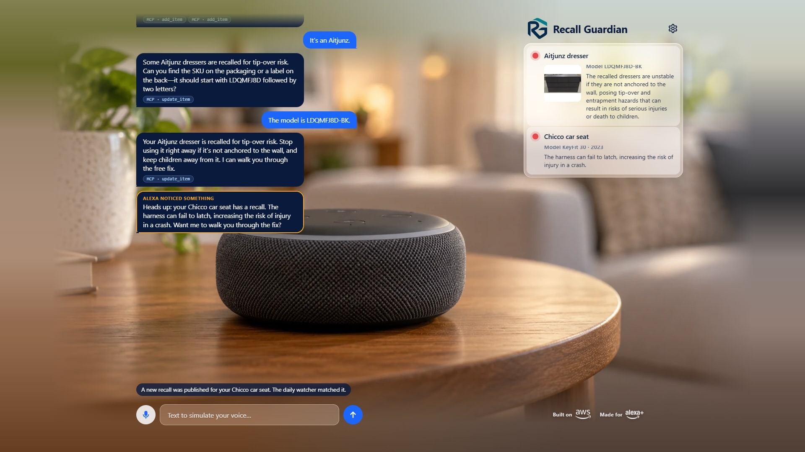

<div align="center">


# Recall Guardian

**An MCP server that turns Alexa+ into a recall guardian for everything in the home.**

_Amazon already protects what you buy on Amazon. Recall Guardian protects everything else in your home._

[](https://github.com/RocoCroco/amazon-developer-hackathon/actions/workflows/ci.yml)
[](LICENSE)
[](https://modelcontextprotocol.io/specification/2025-11-25)
[](#how-it-works)

</div>

## Demo

<a href="https://youtu.be/6uLrt3lpJdU"></a>

**Live demo:** https://6aqlg4s33zg7tgjhoqsetxjqyi0pctry.lambda-url.us-east-1.on.aws/

Open it in Chrome or Edge, allow the microphone once and say _"Alexa, we got a second-hand Govee space heater, model
H7131"_, or type it. For the full story, open the settings (gear icon): **Load sample family**, ask _"Is anything we
own recalled?"_, then **Simulate new recall**.

## Screenshots

From the deployed system, at 1920x1080 ([`scripts/shoot-readme.mjs`](scripts/shoot-readme.mjs)).

| 1. Register by voice | 2. A real recall, with the product photo | 3. Alexa speaks up, unprompted |
| :---: | :---: | :---: |
| [](docs/assets/screenshots/01-register.jpg) | [](docs/assets/screenshots/02-recall.jpg) | [](docs/assets/screenshots/03-heads-up.jpg) |
| Two gifted items; every answer comes from MCP tool calls (the chips) | The brand is confirmed, the model is checked, the dresser turns red | The daily watcher matched a new car-seat recall; Alexa warns the family |

## The problem

When a car seat, a space heater or a dresser is recalled, most owners never find out.

- **About 6%** of consumers act on a recall announced by press release, and **about 50%** when they are told
  directly (CPSC staff, Recall Effectiveness Workshop, 2017).
- The CPSC's own workshop report lists **home voice assistants** among the registration methods it intends to work
  on to promote direct notice (CPSC Recall Effectiveness Workshop Report, Feb. 22, 2018, p. 5).
- Amazon already emails customers about recalls of products **bought on Amazon**. Nothing covers the rest of the
  home: gifts, second-hand and hand-me-down items, in-store purchases, cars, food and medicine.

The bottleneck is that nobody knows who owns what, because nobody fills in registration cards. A voice assistant
already in the home can know, check and warn. Exact quotes, page numbers and caveats: [docs/sources.md](docs/sources.md);
more figures: [docs/impact.md](docs/impact.md).

## How it works


<sub>Made from the official AWS Architecture Icons: [SVG](docs/assets/architecture.svg) ·
[source](scripts/build-architecture.mjs) (`node scripts/build-architecture.mjs`) · every component in
[docs/architecture.md](docs/architecture.md).</sub>

1. **The family talks to Alexa+.** The simulator page listens for "Alexa" and streams the request to **Amazon
   Transcribe**; the simulator Lambda runs the conversation with **Claude on Amazon Bedrock** and answers with
   **Amazon Polly**.
2. **Alexa+ calls the Recall Guardian MCP server** (spec 2025-11-25, Streamable HTTP, official TypeScript SDK) on
   **AWS Lambda**, as any MCP-capable assistant would: 11 tools to register items, check them, and walk through fixes.
3. **The server checks official recall data** live from the **CPSC**, **NHTSA** and **openFDA**, with a copy in
   **DynamoDB** so a government API outage does not turn into "no recalls".
4. **A daily watcher** (**EventBridge** + **Lambda**) pulls new recalls, matches them against every household and
   writes alerts; Alexa speaks them unprompted: _"Heads up: your car seat has a recall."_

What is real and what is simulated: the MCP server, the data, the matcher and the watcher are the product. The
assistant itself is a simulated Alexa+ (Claude on Bedrock with Transcribe and Polly), which the hackathon rules
allow; it talks to the server exactly as an assistant would. Every component, end to end:
[docs/architecture.md](docs/architecture.md).

## Technical highlights

**The matcher pipeline** ([`packages/mcp-server/src/matcher`](packages/mcp-server/src/matcher))

1. **Candidates** from every source at once: live CPSC, NHTSA and openFDA lookups (6 s timeout each) plus the
   DynamoDB recall cache, indexed by brand and product words.
2. **Deterministic match**: normalized brands and model codes, per-product model years, production windows with
   month precision, exact vehicle model names, dosage forms. The result is `strong` (it is recalled), `possible`
   (one detail is missing) or nothing.
3. **Heard-wrong brands**: a brand that matches nothing is compared by sound with the recalled brands of the same
   kind of product ("8 Junes" becomes _"Do you mean Aitjunz, A-I-T-J-U-N-Z?"_).
4. **Second opinion**: Claude reviews each match and may only downgrade it, never upgrade it.
5. **Clarification**: when a match is `possible`, the one question that settles it (model, year, month, lot code).
   Alexa never claims a recall it is not sure about, and never says "no recalls" when it could not check.

**Honest evaluation** ([docs/matcher-results.md](docs/matcher-results.md))

| Test set | Size | Result |
|---|---|---|
| Real recall corpus | **1,313** recalls from CPSC, NHTSA and openFDA | every test item is compared against all of them |
| Hand-labeled items | 77 items, 101,101 item × recall pairs | 100% strong precision and recall (some labels were reconciled after review, so read it as optimistic) |
| Generated items | 478 items, 627,614 pairs | 100% strong precision and recall |
| Blind challenge set | 40 messy descriptions, labeled before running the matcher | **0 false "recalled" claims**; 21 of 26 recalled items handled safely on the blind first run (80.8%), 26 of 26 after two general fixes |

**The daily watcher**: every day at 07:00 UTC, EventBridge runs a Lambda that pulls what is new from CPSC, openFDA
and the NHTSA bulk file (streamed, never fully in memory), matches only new or revised recalls against every
household, and writes deduplicated alerts.

**Security and cost controls**: least-privilege IAM per function; the shared demo key lives in SSM Parameter Store,
never in code; presigned Transcribe URLs, so no AWS credentials reach the browser and no audio passes through our
servers; daily caps on model turns, spoken characters and speech streams, shared by all containers; serverless only,
with a CDK test that fails if any resource has an hourly price. About $12 a month at demo usage
([docs/costs.md](docs/costs.md)).

**The test suite**: 447 offline tests run in CI on every push: the matcher on real recalls, every MCP tool over real
HTTP, data adapters on real fixtures, CDK assertions, and the web page in headless Chromium with a fake microphone.
Two more levels run against real services: `npm run test:live` (real Claude, Polly, Transcribe and the government
APIs) and `npm run e2e:deployed` (the deployed stack, end to end).

## MCP tools

Every answer starts with one short sentence an assistant can read aloud, then structured details, and a `next_step`
when the assistant must do something specific. A test drives all eleven tools and enforces these rules.

| Tool | What it does |
|---|---|
| `add_item` | Register a product, vehicle or food; checks recalls as soon as it knows enough, and says what is still needed |
| `update_item` | Complete an item (brand, model, year); re-checks recalls in the same call |
| `list_items` | The household inventory |
| `remove_item` | Remove an item, after asking for confirmation |
| `check_item` | One item: `recalled`, `need_info` (with the question to ask), `no_recall` or `outside_period` |
| `check_household` | Check everything now and record alerts |
| `get_alerts` | Open alerts, most severe first |
| `get_remedy` | How to fix it: stop using it first, then the free repair, replacement or refund, and who to call |
| `resolve_alert` | Close an alert (fixed, stopped using, not affected, dismissed) |
| `update_allergies` | Who in the family is allergic to what; food recalls for an undeclared allergen are flagged for that person |
| `recent_allergen_recalls` | "Any recent peanut recalls?", from openFDA, newest first |

## Quick start

Prerequisites: Node.js 22 or newer, npm 10 or newer. No AWS account is needed to run the tests or the offline demo.

**Run the tests**

```bash
npm install
npm run lint
npm test             # offline and deterministic, about 2 minutes
```

**Run locally**

```bash
npm run build
# MCP server on :8788 (in-memory inventory, live CPSC/NHTSA/openFDA lookups)
node packages/mcp-server/dist/main.js
# Simulator on :8787. SIM_LLM=mock is an offline rule-based brain; SPEECH=off uses the browser's voice
SIM_LLM=mock SPEECH=off MCP_URL=http://127.0.0.1:8788/mcp node packages/simulator/dist/main.js
```

In PowerShell, set the variables first (`$env:SIM_LLM='mock'`, and so on). For the real brain, drop `SIM_LLM=mock`
and use an AWS profile with Amazon Bedrock access.

**Deploy to AWS** (region us-east-1, serverless only)

```bash
aws configure                              # a profile for the target account
cd infra && npx cdk bootstrap --tags Project=recall-guardian
# the shared demo key lives in SSM, never in code (Git Bash: export MSYS_NO_PATHCONV=1)
aws ssm put-parameter --region us-east-1 --name /recall-guardian/demo-key --type SecureString \
    --value "$(node -e "process.stdout.write(require('crypto').randomBytes(24).toString('base64url'))")"
npm run deploy                             # MCP, watcher and simulator Lambdas, DynamoDB, the daily rule
# one-time: load recall history into the cache
aws lambda invoke --function-name <WatcherFunctionName output> --payload '{"backfill":"child-seats"}' \
    --cli-binary-format raw-in-base64-out out.json
```

Needs Amazon Bedrock model access for Claude Haiku 4.5 in us-east-1. `npx cdk destroy` removes everything the stack
created. Check the deployment with `npm run e2e:deployed`.

## Hackathon

Built for the **Amazon "Build, Ship, Shape" hackathon**. Rules as we read them: [docs/rules.md](docs/rules.md). Full
evidence for every point below: [docs/challenges.md](docs/challenges.md).

### Alexa+ track

> "Build a working Agent Skill or a self-hosted MCP server, implementing MCP spec version (minimum acceptable version
> is 2025-11-25)"

A **self-hosted MCP server** on AWS Lambda, using the official TypeScript SDK with **spec 2025-11-25** (the
negotiated protocol version is asserted in a test) over **stateless Streamable HTTP**. It is used at runtime, not
just mentioned: every assistant answer comes from MCP tool calls, shown as chips on the page. The Alexa+ assistant
itself is simulated, as the track allows, and calls the server exactly as an assistant would.

### AWS Builder mini challenge

> "Any primary track project that incorporates AWS services (i.e. Amazon Bedrock, AgentCore, Strands SDK, Kiro
> Crew, SageMaker, etc.) with documented integrations"

Eleven AWS services, each documented with what it does and where it is in the code: **Amazon Bedrock** (the
assistant's brain, and the matcher's downgrade-only second opinion), **Amazon Transcribe** (streaming speech with a
vocabulary of ~2,000 recall brands), **Amazon Polly** (the voice), **AWS Lambda** (three functions), **Amazon
DynamoDB** (inventories, alerts, the recall cache, spending caps), **Amazon EventBridge** (the daily watcher),
**AWS Systems Manager Parameter Store** (the demo key), **Amazon S3** (the vocabulary file), **Amazon CloudWatch**
(logs), **AWS IAM** (least privilege) and **AWS CDK / CloudFormation** (the whole stack as code). Table with file
paths: [docs/challenges.md](docs/challenges.md#aws-builder-mini-challenge).

### Open Source mini challenge

> "Create a new, additional open-source project or contribute to an existing public repository during the hackathon
> window, alongside a primary track submission"

A new, separate project created during the hackathon: the
**[Open Recall Format](https://github.com/RocoCroco/open-recall-format)**, an open, owner-side data format for
product recalls, with converters for seven official recall sources, a reference checker, a CLI and tests on real
government records (Apache-2.0 code, CC BY 4.0 specification). Plus a contribution to an existing public repository:
a schema.org `ProductRecall` proposal
([schemaorg/schemaorg#3229](https://github.com/schemaorg/schemaorg/issues/3229#issuecomment-5979280862)).

### Feedback and friction log

- [FEEDBACK.md](FEEDBACK.md): feedback on every tool, API and SDK we used.
- [FRICTION_LOG.md](FRICTION_LOG.md): every significant problem, what we tried, and how we solved it.

## License and acknowledgments

[MIT](LICENSE).

- Recall data: U.S. Consumer Product Safety Commission ([SaferProducts.gov](https://www.saferproducts.gov/)),
  National Highway Traffic Safety Administration ([NHTSA datasets and APIs](https://www.nhtsa.gov/nhtsa-datasets-and-apis)),
  U.S. Food and Drug Administration ([openFDA](https://open.fda.gov/)). Recall Guardian is not affiliated with or
  endorsed by these agencies.
- [Model Context Protocol](https://modelcontextprotocol.io/) and its official
  [TypeScript SDK](https://github.com/modelcontextprotocol/typescript-sdk).
- Architecture diagram icons: [AWS Architecture Icons](https://aws.amazon.com/architecture/icons/).

Alexa, Amazon, AWS and the related logos are trademarks of Amazon.com, Inc. or its affiliates. This is an
independent hackathon project.
