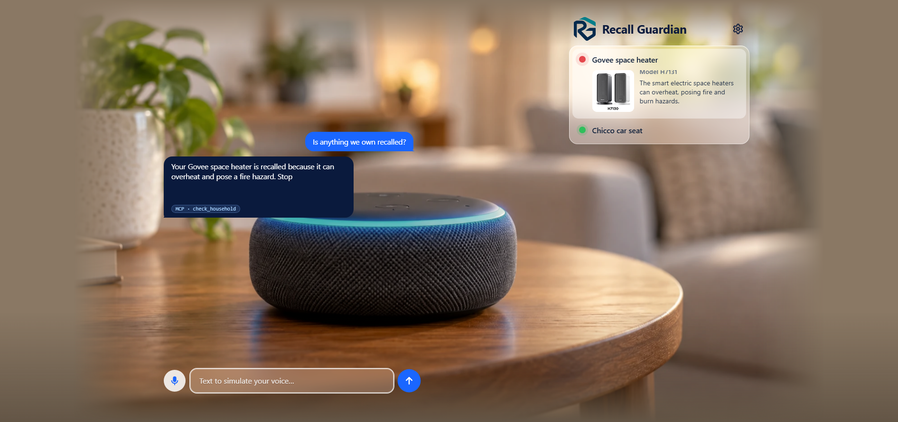
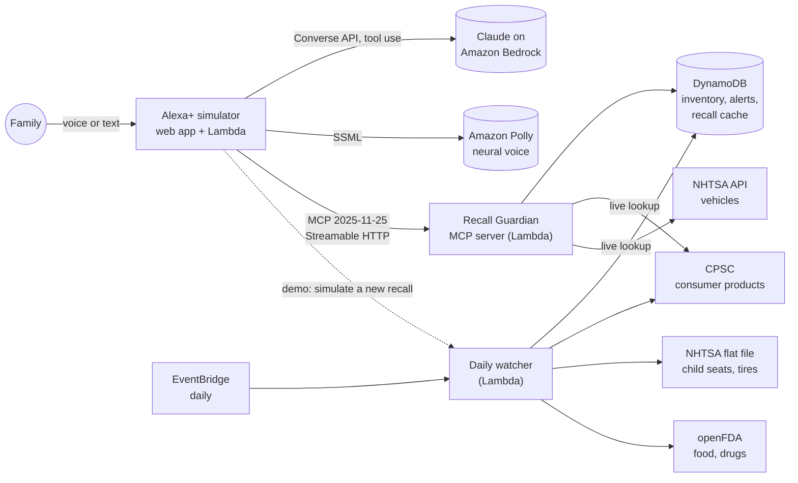

# Recall Guardian

**An MCP server that turns Alexa+ into a recall guardian for everything in the home.**
Built for the Amazon "Build, Ship, Shape" hackathon, Alexa+ track.

> *Amazon already protects what you buy on Amazon. Recall Guardian protects everything else in your home.*



**Live demo:** https://6aqlg4s33zg7tgjhoqsetxjqyi0pctry.lambda-url.us-east-1.on.aws/
(open the chevron menu next to the logo and click **Load sample family**, ask *"Is anything we own recalled?"*, then **Simulate new recall** from the same menu; voice works in Chrome and Edge, typing everywhere.)

## The problem

When a car seat, a space heater or a dresser is recalled, most owners never find out. At the CPSC's 2017 Recall
Effectiveness Workshop, agency staff reported that the average consumer-level correction rate is **about 6%**; for
recalls announced only by press release it is about 6%, while **direct notice ("recall alerts") reaches about 50%**.
The agency's own workshop report lists *home voice assistants* among the ideas to improve direct notice.
([exact quotes and caveats](docs/sources.md))

Amazon notifies customers about recalls of products bought **on Amazon** (email and an alert banner on *Your
orders*). Nothing covers the rest of the home: gifts, second-hand and hand-me-down items, in-store purchases, cars,
food and medicine. The bottleneck is that nobody knows who owns what, because nobody fills in registration cards.

## What it does

1. **Register by voice**: "We got a hand-me-down Graco car seat." Alexa asks only what is needed (brand, model, roughly when it was made).
2. **Check instantly**: "Is anything we own recalled?" Official CPSC, NHTSA and openFDA data, matched carefully.
3. **Watch continuously**: a daily job pulls new recalls and matches them against every household.
4. **Alert proactively**: "Heads up: your car seat has a recall for a harness defect."
5. **Guide the fix**: stop-using advice first, then the free repair/replacement/refund and who to call. Track it to done.

Alexa never claims a recall it is not sure about: when a detail is missing it asks one short question
(the model sticker, the month it was made, the lot code) instead of guessing.

## Architecture



- **MCP server** (`packages/mcp-server`): TypeScript, official `@modelcontextprotocol/sdk`, **MCP spec 2025-11-25**,
  **Streamable HTTP** (stateless, JSON responses), on AWS Lambda behind a Function URL, with a shared demo key and
  unguessable household ids.
- **Alexa+ simulator** (`packages/simulator`): the demo surface, because the real Alexa+ MCP toolkit may not be
  available to us (the hackathon rules allow a simulated experience). Claude on Bedrock is the "Alexa+ brain" and talks
  to the server as a **real MCP client**; Web Speech API for the microphone, Amazon Polly for the voice.
- **Infrastructure** (`infra`): AWS CDK, us-east-1, serverless only, everything tagged `Project=recall-guardian`.

### The nine MCP tools

| Tool | What it does |
|---|---|
| `add_item` | Register a product, vehicle or food; says what is still needed to identify it |
| `list_items`, `update_item` | See and complete the household inventory |
| `remove_item` | Remove an item; **asks for confirmation first** |
| `check_item` | One product: `recalled` / `need_info` (with the question to ask) / `no_recall` / `outside_period` |
| `check_household` | Check everything now and record alerts |
| `get_alerts` | Open alerts, most severe first |
| `get_remedy` | Step-by-step fix: safety action, free repair/replacement/refund, phone (digits spelled for speech) |
| `resolve_alert` | Close an alert (fixed, stopped using, not affected, dismissed) |

Every response leads with one short spoken sentence and puts details in structured fields; a test drives all
nine tools and enforces the voice-first rules (short, no URLs, no markup, no internal ids).

## Data sources (official, free, no keys)

| Source | Covers | How we use it |
|---|---|---|
| CPSC SaferProducts.gov Recalls API | consumer products | live lookup, plus daily incremental sync |
| NHTSA recalls API + vPIC | vehicles, VIN decoding | live lookup by make, model and year |
| NHTSA bulk recall file | child car seats, tires, equipment | streamed daily (15 MB zip, never fully in memory); seats backfilled once |
| openFDA enforcement reports | food, drugs | daily incremental sync |

Details, limits and quirks we hit: [docs/data-sources.md](docs/data-sources.md).

## How good is the matching?

The matcher is deterministic first (brand and model normalization, model years, production windows), with a Claude
second opinion that can only make an answer **more** careful, never less. It is evaluated on **1,313 real recalls**
with 77 hand-labeled items and 478 generated items (about 730,000 item x recall pairs):
**100% strong-match precision and recall on both sets**, with the honest history of how we got there, including
the labels we got wrong and the bugs the evaluation found, in [docs/matcher-results.md](docs/matcher-results.md).
Food and drug recalls are never confirmed without the lot code, because only the package knows it.

## Run it locally

Prerequisites: Node 22+ (developed on 24), npm 10+. No AWS needed for tests or the offline demo.

```bash
npm install
npm test            # ~340 tests: matcher on real data, MCP over HTTP, infra assertions, real-browser UI
npm run lint
npm run build
```

```bash
# MCP server (in-memory inventory, live CPSC/NHTSA lookups) on :8788
node packages/mcp-server/dist/main.js
# Simulator UI on :8787. SIM_LLM=mock uses the offline rule-based brain (no AWS); SPEECH=off uses the browser voice
SIM_LLM=mock SPEECH=off MCP_URL=http://127.0.0.1:8788/mcp node packages/simulator/dist/main.js
```
(PowerShell: set `$env:SIM_LLM='mock'` etc. first.) For the real brain drop `SIM_LLM=mock` and use an AWS profile with Bedrock access.

## Deploy to AWS

```bash
aws configure                       # a profile for the target account, region us-east-1
cd infra && npx cdk bootstrap --tags Project=recall-guardian
# the shared demo key lives in SSM, never in code or templates (Git Bash: export MSYS_NO_PATHCONV=1)
aws ssm put-parameter --region us-east-1 --name /recall-guardian/demo-key --type SecureString \
    --value "$(node -e "process.stdout.write(require('crypto').randomBytes(24).toString('base64url'))")"
npm run deploy                      # MCP Lambda, watcher Lambda + daily rule, simulator Lambda, DynamoDB
# one-time: load every historical child-seat recall into the cache
aws lambda invoke --function-name <WatcherFunctionName output> --payload '{"backfill":true}' \
    --cli-binary-format raw-in-base64-out out.json
```
Needs Bedrock model access for Claude Haiku 4.5 in us-east-1. `npx cdk destroy` removes everything the stack created.

## How to test

| Command | What it proves |
|---|---|
| `npm test` | everything above, offline and deterministic (real fixtures and a real-recall corpus) |
| `npm run test:live` | real CPSC/openFDA/NHTSA feeds, real Claude on Bedrock (conversation and second opinion), real Polly |
| `npm run e2e:deployed` | the **deployed** system: all three data sources, the watcher with a seeded recall, and the public simulator in a real browser with real Claude and Polly |

The SPEC section 8 demo story (register, check, time skip, proactive alert, walk through the fix, reset) is also an
automated test that runs three times in a row: `packages/simulator/src/demo-story.test.ts`.

## Cost and safety

About **$8 a month at demo usage** (almost all of it Claude Haiku and Polly; everything else is inside free tiers):
[docs/costs.md](docs/costs.md). Spending guards: a per-session turn limit, a daily cap on model turns and spoken
characters shared by all containers, the demo key on the MCP endpoint, unguessable household ids, no resource with an
hourly price.

## Repository map

```
packages/mcp-server   MCP server, matcher, recall adapters, watcher, tools
packages/simulator    Alexa+ simulator: handler (Node + Lambda), agent loop, voice, demo mode, web UI
infra                 AWS CDK stack
scripts               fixtures, corpus builder, deployed verification scripts
docs                  data sources, matcher results, costs, sources for claims, hackathon notes
SPEC.md TASKS.md      the plan this was built from; FRICTION_LOG.md and FEEDBACK.md for the hackathon
```

## Limits (what is not done)

- The simulator stands in for the real Alexa+ integration; the MCP server itself is independent of it.
- Food, drug, tire and equipment recalls older than the daily watcher's history are not searchable yet; consumer
  products, vehicles and child seats are covered end to end ([details](docs/data-sources.md)).
- US recall databases only; non-US sources are future work. Accounts are a household id, not OAuth.

## License

MIT
