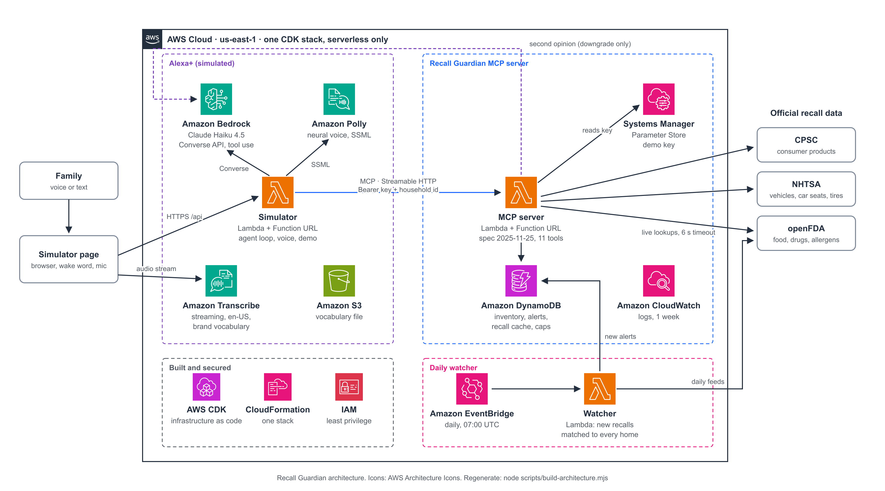

# Architecture

Recall Guardian is two things: a **self-hosted MCP server** that keeps a household's inventory and matches it
against official recalls (the deliverable for the Alexa+ track), and an **Alexa+ simulator** that talks to it the
way an assistant would (Claude on Amazon Bedrock as the brain, Amazon Transcribe for the ears, Amazon Polly for the
voice). Everything runs serverless on AWS in us-east-1, defined in one CDK stack (`infra/`).

## 1. The pieces



<sub>Made from the official AWS Architecture Icons. [SVG](assets/architecture.svg) · regenerate with `node scripts/build-architecture.mjs`.</sub>

| Part | Code | Runs on |
|---|---|---|
| MCP server: tools, matcher, recall adapters | `packages/mcp-server/src` | Lambda + Function URL (`lambda.ts`); also plain Node (`main.ts`) |
| Daily watcher: syncs feeds, matches new recalls to every household, raises alerts | `packages/mcp-server/src/watcher*.ts` | Lambda, EventBridge rule |
| Alexa+ simulator: page, agent loop, voice | `packages/simulator/{src,public}` | Lambda + Function URL (page embedded in the bundle) |
| Infrastructure | `infra/lib/recall-guardian-stack.ts` | AWS CDK |

## 2. A spoken turn, end to end

```mermaid
sequenceDiagram
  participant U as Family
  participant P as Page
  participant T as Transcribe
  participant S as Simulator Lambda
  participant C as Claude (Bedrock)
  participant M as MCP server
  participant D as Recall data
  participant V as Polly
  U->>P: "Alexa, we were gifted an Aitjunz dresser"
  Note over P: browser recognizer hears "Alexa"; last 3 s of audio kept
  P->>S: POST /api/transcribe
  S-->>P: presigned wss:// URL (60 s, en-US, vocabulary)
  P->>T: audio frames (event stream), including the 3 s before the wake word
  T-->>P: "we were gifted an 8 June dresser" (partial, then final)
  Note over P: words shown live; sent ~0.6-1.2 s after the last new word
  P->>S: POST /api/chat
  S->>C: conversation + 11 tool definitions (MCP tools/list)
  C->>S: tool call add_item {name: dresser, brand: "8 June"}
  S->>M: tools/call add_item
  M->>D: candidates by brand and product (live + cache)
  M-->>S: "do you mean Aitjunz, A-I-T-J-U-N-Z?" + next_step
  S->>C: tool result
  C-->>S: "Do you mean Aitjunz, spelled A-I-T-J-U-N-Z?"
  S-->>P: reply + MCP tool chips
  P->>S: POST /api/speak (text, voice)
  S->>V: SSML (codes spelled with say-as)
  V-->>P: MP3; words revealed in step with the audio
  Note over P: follow-up: listens 8 s without the wake word
```

## 3. The MCP server

- **Protocol:** official TypeScript SDK (`@modelcontextprotocol/sdk`), spec **2025-11-25**, **Streamable HTTP**,
  stateless (a fresh server and transport per request, JSON responses). One web-standard `Request -> Response`
  handler (`handler.ts`) runs unchanged on Lambda, on Node and in tests.
- **Access:** `Authorization: Bearer <demo key>` (the key lives in SSM Parameter Store, never in code) and an
  unguessable household id header (128+ random bits). Per-household OAuth is the main production gap (stretch S1).
- **Voice-first answers:** every tool result starts with one short sentence an assistant can read aloud (no URLs,
  no markup, phone digits and model codes spelled), plus `structuredContent` with the details, and, when the
  assistant must do something specific next, a `next_step` (for example "if the user confirms, call update_item
  with brand Aitjunz"). A test drives every tool and enforces these rules.

| Tool | Purpose |
|---|---|
| `add_item`, `update_item` | Register or complete a product; checks recalls as soon as it knows enough, and asks for the hard-to-find model number only when some models of that brand and product are recalled |
| `list_items`, `remove_item` | Inventory (removal asks for confirmation) |
| `check_item`, `check_household` | Recall checks, recording alerts |
| `get_alerts`, `get_remedy`, `resolve_alert` | What to deal with, how to fix it (stop using first, free remedy, who to call), close it |
| `update_allergies`, `recent_allergen_recalls` | Family food allergies; undeclared-allergen food recalls |

### Matching pipeline (`packages/mcp-server/src/matcher`)

1. **Candidates** from every source at once (`CompositeRecallProvider`): live CPSC by product name and brand, live
   NHTSA by make/model/year, live openFDA by brand, and the DynamoDB recall cache (indexed by brand words and
   product words). Each live lookup gives up after 6 s; a source that fails is reported, not hidden.
2. **Deterministic match** (`match.ts`, `model.ts`): normalized brands and model codes, per-product model years,
   production windows with month precision, vehicle model names that must match exactly, dosage forms. Results:
   `strong` (it is recalled), `possible` (one detail is missing), or nothing.
3. **Heard-wrong brands** (`phonetic.ts`, `clarify.ts`): a brand that matches nothing is compared *by sound* with
   the brands of the same kind of product ("8 June" -> Aitjunz) and confirmed with a spelled question.
4. **Second opinion** (`confirm.ts`): Claude Haiku reviews each match and may only downgrade it (strong to
   possible, or drop it), never upgrade; verdicts are cached; calls run in parallel.
5. **Clarification** (`clarify.ts`): the one question that settles a `possible` match (model, year, month, lot
   code, which brand).

Measured on 1,313 real recalls and a blind challenge set: docs/matcher-results.md.

## 4. The proactive part: the daily watcher

EventBridge invokes the watcher every day at 07:00 UTC. It pulls what is new since its last run from CPSC (by
recall date), openFDA food and drug enforcement reports, and the NHTSA bulk file (streamed and unzipped on the fly,
never held in memory), stores them in the recall cache, matches **only the new or revised recalls** against every
household, and writes alerts (deduplicated, never resurrecting a closed one). The simulator page polls
`/api/state`; a new alert is spoken unprompted ("Heads up: your car seat has a recall...") once Alexa is quiet.
The demo button "Simulate new recall" invokes the same watcher with a seeded recall.

## 5. Data model: one DynamoDB table (on-demand)

| PK | SK | What |
|---|---|---|
| `HH#<household>` | `ITEM#<id>` | an inventory item |
| `HH#<household>` | `ALERT#<id>` | a recall alert (id = hash of item + recall) |
| `HH#<household>` | `ALLERGIES` | the family's food allergies |
| `RCL#<source:id>` | `DATA` | a cached recall, with a content hash to tell revisions from re-fetches |
| `BRAND#<word>` / `PRODUCT#<word>` | `RCL#<id>` | lookup indexes for the cache |
| `CURSOR` | `<feed>` | date up to which a feed is synced (also says whether the CPSC copy is fresh) |
| `SES#<id>` | `DATA` | a simulator conversation (expires after a day) |
| `CAP#<name>#<day>` | `COUNT` | atomic daily spending counters (model turns, spoken characters, speech streams) |

## 6. Resilience (what happens when things break)

- **A government API is down or slow:** 6 s timeout per live lookup; the other sources still answer. CPSC is
  copied into the cache (backfill since mid-2011 plus the daily sync), and that copy covers a CPSC outage only while
  it is less than a week old. If nothing can answer, the tool says "I couldn't reach the recall database" and
  never "no recalls" (`source_unavailable`).
- **The model returns an empty answer:** the last tool's spoken summary is used instead, and the history stays
  valid for Bedrock.
- **Speech recognition hears a brand wrong:** sound-alike matching in the server, a custom Transcribe
  vocabulary of ~2,000 recall brands, and letter-by-letter spelling as the fallback.
- **The watcher fails:** no Lambda retries (the daily rule retries once and the next day catches up), and stale
  queued events are dropped after an hour, so a failing run cannot hammer a struggling API.

## 7. Security and cost guards

- Secrets only in SSM Parameter Store; no AWS credentials ever reach the page (Transcribe URLs are presigned for 60
  s by the simulator's role; no audio passes through our servers).
- IAM: each function gets only what it uses (table read/write, one SSM parameter, one Claude model, Polly,
  Transcribe streaming, invoking the watcher).
- Spending caps shared by all containers (DynamoDB counters): 600 model turns, 120,000 spoken characters and 400
  speech streams per day; 40 turns per conversation; 45 s per speech stream; reserved concurrency per function.
- Serverless only, no resource with an hourly price (a CDK test fails if one appears). About $12 a month at demo
  usage: docs/costs.md.

## 8. The simulator page (`packages/simulator/public`)

- `app.js`: conversation, household panel, settings. Voice states: **wake** (browser recognizer waits for
  "Alexa") -> **request** (Transcribe or the browser records; words appear live; a moment without new words sends
  it) -> **busy** (nothing listens while Alexa thinks and speaks, so she never hears herself) -> **followup**
  (8 s of listening without the wake word; silence or "thanks" ends the conversation).
- `voice.js`: microphone capture (AudioWorklet, 16 kHz PCM, 3 s pre-roll), the Transcribe engine, the browser
  engine (always en-US).
- `eventstream.js`: the AWS event-stream framing Transcribe uses over WebSocket (CRC32, headers), unit-tested.
- The light ring is two photos (off and lit) plus a glow layer: thinking breathes, speaking follows the loudness of
  the Polly audio. The photo is never upscaled; its edges fade into gradients of its own edge colours.

## 9. How it is tested

| Level | What | Command |
|---|---|---|
| Unit and integration | matcher on real recalls, every MCP tool over real HTTP, data adapters on real fixtures, CDK assertions | `npm test` |
| Browser | the page in headless Chromium with fake microphone, recognizer, Transcribe socket and speakers | `npm test` (`*.e2e.test.ts`) |
| Live | real Claude, Polly, Transcribe and the government APIs | `npm run test:live` |
| Deployed | the stack in AWS: each data source, the watcher with a seeded recall, the public simulator with real Claude and Polly | `npm run e2e:deployed` |
